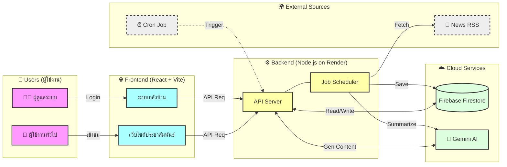

# 🏫 Nongmim Child Development Center Management System

## 📋 ภาพรวมโปรเจกต์ (Project Overview)
ระบบบริหารจัดการศูนย์พัฒนาเด็กเล็กแบบ Full-stack ที่เชื่อมต่อระหว่างเว็บไซต์ประชาสัมพันธ์และระบบหลังบ้านสำหรับผู้ดูแลระบบ (Admin) โดยมีการนำ **AI (Google Gemini)** มาช่วยในการทำงานอัตโนมัติ เช่น การเขียนข่าวและการตอบคำถาม

## 🛠️ เทคโนโลยีที่ใช้ (Tech Stack)
*   **Frontend**: React.js (Vite), Tailwind CSS
    *   *Hosting*: **Firebase Hosting**
*   **Backend**: Node.js, Express.js
    *   *Hosting*: **Render (Cloud Application Hosting)**
*   **Database**: **Firebase Cloud Firestore** (NoSQL Database)
*   **AI Integration**: Google Gemini API (สำหรับสรุปข่าวและ Chatbot)
*   **Automation**: Node-cron + External Cron Trigger

## 🏗️ แผนภาพการทำงานของระบบ (System Architecture)



## 🚀 วิธีการเริ่มโปรเจกต์ (How to Start)

### 1. เตรียม Environment Variables
ตรวจสอบไฟล์ `.env` ในทั้งสองโฟลเดอร์:
*   **Backend (`/Backend/.env`)**: ต้องมีค่า `GEMINI_API_KEY`, `FIREBASE_SERVICE_ACCOUNT` (หรือไฟล์ key json), `JWT_SECRET`
*   **Frontend (`/frontend/.env`)**: ต้องมีค่า `VITE_API_URL` (เช่น `http://localhost:5000/api`)

### 2. รันระบบหลังบ้าน (Backend)
```bash
cd Backend
npm install
npm run dev
# Server จะเริ่มทำงานที่ Port 5000
```

### 3. รันระบบหน้าบ้าน (Frontend)
เปิด Terminal ใหม่:
```bash
cd frontend
npm install
npm run dev
# Web จะเริ่มทำงานที่ http://localhost:5173
```
